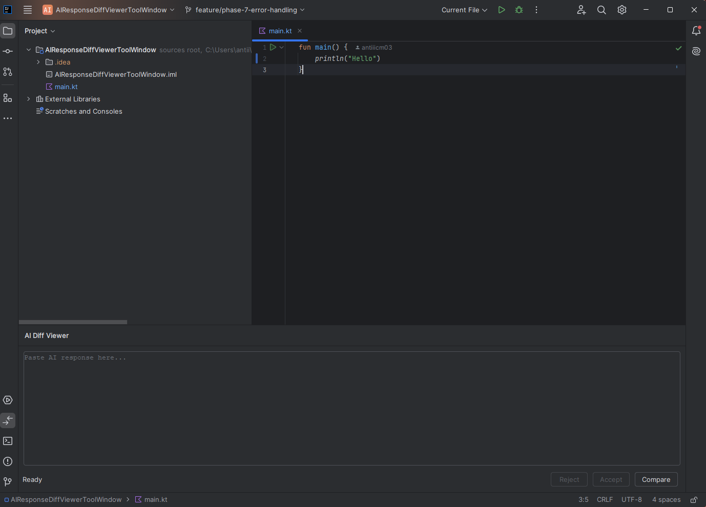
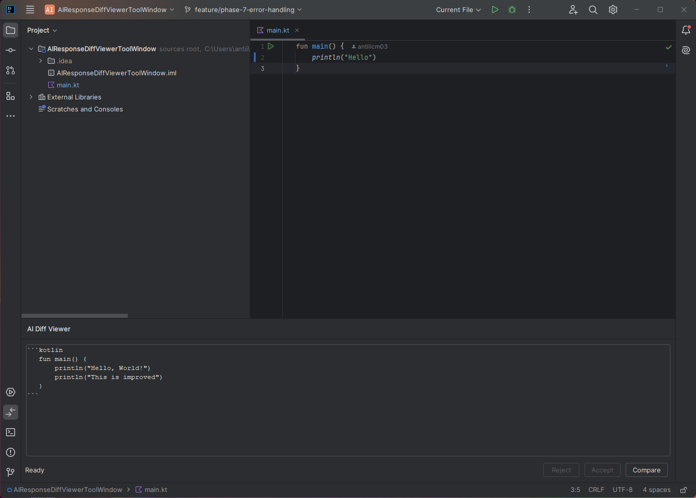
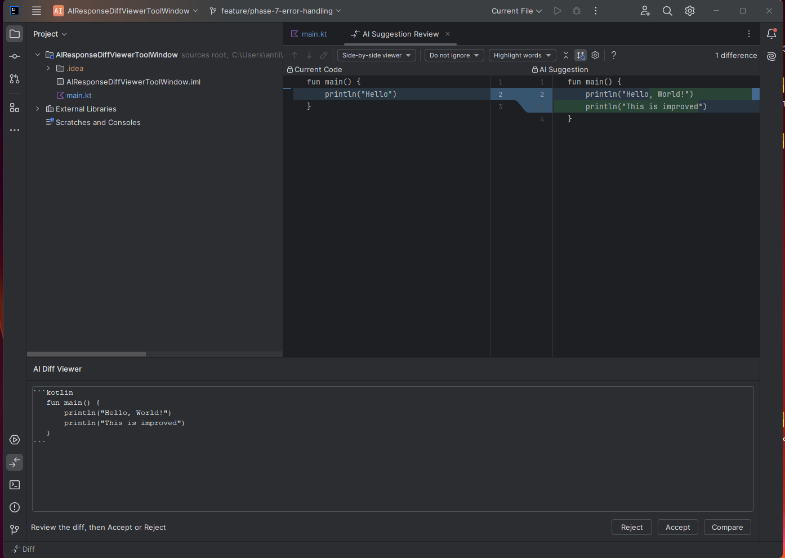
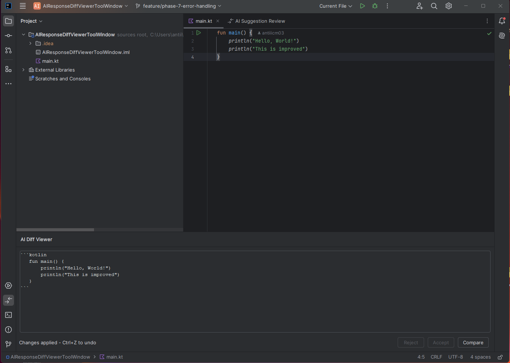

# AI Response Diff Viewer

<!-- Plugin description -->
A lightweight IntelliJ IDEA plugin that converts AI-generated code suggestions into a structured, IDE-native review workflow — before any changes are applied to your codebase.
<!-- Plugin description end -->

---

## Project Overview

AI Response Diff Viewer adds a missing step to the modern AI-assisted development workflow: **review before apply**.

The plugin provides a dedicated ToolWindow where developers paste any AI-generated response. It extracts the code block, resolves the relevant file or selection from the active editor, and opens IntelliJ's native diff viewer — so the developer sees exactly what would change before deciding.

No code is applied automatically.

---

## Problem Statement

AI coding assistants are now a standard part of development. But the typical interaction has a structural gap:

```
Developer asks AI → AI returns code → Developer copies and pastes → Hopes nothing breaks
```

There is no review step. The developer either applies the suggestion blindly or manually compares the AI output against existing code — which is slow and error-prone.

AI-generated code can introduce subtle logic errors, conflict with existing patterns, or modify more than what was asked for. An IDE-native diff review addresses this directly. Developers already trust the diff interface — it is the same tool they use for Git and merge conflict resolution. Bringing AI suggestions into that interface makes review natural rather than manual.

---

## Why This Plugin — Why This Team

The internship position is on the **JetBrains AI Assistant Chat team**. The most relevant thing to demonstrate is not building another chat interface — JetBrains already has one. What matters more is thinking about the problems that exist *around* the chat interface.

One of the clearest unsolved problems in AI-assisted coding is the gap between receiving a suggestion and safely integrating it. This plugin addresses that gap directly, inside the IDE, using native platform components.

The plugin is intentionally **provider-agnostic** — it works with responses from JetBrains AI Assistant, Claude, ChatGPT, Copilot, or any other source. The review problem exists regardless of which AI generated the code.

---

## AI-Related Logic

The AI-related value here is not in generating text. It is in **parsing, contextualizing, and safely staging** AI-generated code for integration.

**AI Response Parsing**
The `MarkdownCodeBlockParser` extracts code blocks from raw AI responses using the markdown format all major AI tools produce. Language tags are detected when present; multiple blocks are supported — the MVP uses the first, but the architecture is ready for hunk-level selection.

**Context Resolution**
The `EditorContextResolver` reads the current IDE state: if the developer has selected a code region, that becomes the comparison target. If not, the full content of the active file is used. The AI suggestion is compared against the actual code it would replace — not a placeholder.

**DiffSession Assembly**
The resolved context and extracted code block are combined into a `DiffSession` — an immutable object carrying both sides of the diff, the file path, and the detected language.

**Review-First Design**
Nothing is applied automatically. Changes are applied only on explicit user confirmation via `WriteCommandAction`, preserving full undo/redo support.

---

## Architecture

The plugin is structured around a central orchestrator coordinating isolated, single-responsibility services. No layer knows the implementation details of another.

```
ToolWindow          →  UI entry point, no business logic
DiffOrchestrator    →  pipeline coordinator
CodeBlockParser     →  extracts code blocks from AI response
ContextResolver     →  reads active editor selection or file
DiffSession         →  immutable carrier for the diff payload
DiffViewerManager   →  opens IntelliJ native diff UI
FileApplyService    →  applies accepted changes safely
ErrorHandler        →  centralizes all failure scenarios
```

All services are defined as interfaces. `DiffOrchestrator` depends only on abstractions — concrete implementations are injected, keeping each layer independently testable and replaceable.

Errors are modeled as a `sealed class DiffViewerError`, which forces exhaustive `when` handling — no failure case can be silently missed.

---

## Design Decisions

**DiffOrchestrator as central coordinator**
All pipeline logic lives in the orchestrator. The ToolWindow contains zero business logic — it only delegates to the orchestrator and updates the UI based on the result. This keeps the system maintainable and makes the orchestrator independently testable with mock implementations.

**Parser targets markdown code blocks only**
The plugin is designed for AI responses, not arbitrary text. All major AI tools (Claude, ChatGPT, Copilot, Gemini, JetBrains AI Assistant) format code suggestions using markdown fenced blocks. Accepting plain text would blur the product boundary and weaken the error feedback. Strict parsing with clear user feedback is a better UX than a silent fallback.

**IdenticalContent blocks diff opening**
If the AI suggestion matches the current code, opening an empty diff viewer would be confusing and look like a bug. The orchestrator detects this case before opening the diff and surfaces a clear message instead.

**LanguageMismatch is a warning, not a hard failure**
A developer might intentionally compare a Kotlin file against a Java suggestion, or the language tag might simply be wrong. The plugin warns about the mismatch but does not block the diff — the developer decides.

**Document reference captured at resolution time**
`FileApplyService` stores the document reference when context is resolved, not when the user clicks Accept. By the time Accept is clicked, the diff viewer has focus and `selectedTextEditor` may no longer point to the original file.

**Native IntelliJ diff viewer over custom UI**
IntelliJ's diff component is mature, familiar, and consistent with the rest of the IDE. Building a custom diff UI would introduce visual inconsistency and significant implementation overhead with no benefit.

**Auto-close diff viewer — known limitation**
Closing the diff window automatically after Accept/Reject was explored but not included in the MVP. IntelliJ opens the diff viewer asynchronously, making reliable window reference tracking complex without hooking into internal APIs. This is documented as a future improvement.

---

## MVP Scope

The MVP covers the full review workflow end-to-end:

```
Paste AI response → Extract code block → Resolve active file
→ Open native diff viewer → Accept or Reject → Apply with undo support
```

What is explicitly out of scope for MVP:
- Direct integration with JetBrains AI Assistant chat panel
- Partial hunk acceptance
- Multi-file patch support
- Auto-close of diff viewer after decision

---

## Development Phases

### Phase 1 — Skeleton 
- Gradle + IntelliJ Platform Plugin SDK configured
- ToolWindow registered in `plugin.xml` and visible in sandbox IDE
- Plugin compiles and runs via `./gradlew runIde`

### Phase 2 — Domain Models & Core Architecture 
- Domain models: `AiResponse`, `CodeBlock`, `DiffSession`, `TargetContext`
- Service interfaces with clear single responsibilities
- `DiffOrchestrator` as central pipeline coordinator
- `sealed class DiffViewerError` covers all failure scenarios

### Phase 3 — Input Layer & Code Parsing 
- ToolWindow UI: text area, Compare button, status label
- `MarkdownCodeBlockParser` with regex-based extraction
- Handles: empty input, missing blocks, multiple blocks, missing language tag

### Phase 4 — Context Resolution 
- `EditorContextResolver` reads active selection or falls back to full file
- `DiffSession` assembled and passed through the orchestrator pipeline
- ToolWindow fully delegates to orchestrator

### Phase 5 — Diff Engine & Native Diff Viewer 
- `IntelliJDiffViewerManager` using IntelliJ's native diff API
- Side-by-side diff with labeled panels: "Current Code" vs "AI Suggestion"
- Full pipeline functional: paste → parse → resolve → diff

### Phase 6 — Apply Layer 
- `IntelliJFileApplyService` with `WriteCommandAction` for safe file modification
- Accept applies AI suggestion with full undo/redo support
- Reject clears state without touching the file
- Accept / Reject buttons disabled until active diff session exists

### Phase 7 — Error Handling & UX Polish 
- `IdenticalContent` detection blocks diff when no changes exist
- `LanguageMismatch` warning for mismatched file and suggestion language
- `NoActiveDiffSession` error when Accept is clicked without active session
- Improved error messages with clear, actionable user feedback
- Status label reflects current state at every step
- Test suite refactored into 4 organized files

---

## Testing

Tests are organized to mirror the main source structure:

```
src/test/
├── parser/
│   └── MarkdownCodeBlockParserTest.kt   — 6 tests
├── model/
│   └── DiffSessionTest.kt               — 3 tests
├── error/
│   └── DiffViewerErrorTest.kt           — 3 tests
└── orchestrator/
    └── DiffOrchestratorTest.kt          — 5 tests
```

Orchestrator tests use lightweight mock implementations without external libraries — a direct consequence of the dependency injection architecture. Each mock implements a single interface, keeping tests minimal and readable.

Run tests:
```bash
./gradlew test
```

---

## Known Limitations

- **Manual paste required** — the plugin does not automatically detect AI responses from the JetBrains AI Assistant chat panel; the user must paste the response manually
- **First code block only** — when an AI response contains multiple code blocks, only the first is used for comparison
- **Diff viewer stays open** — after clicking Accept or Reject, the diff viewer window remains open and must be closed manually
- **Full file replacement** — Accept replaces the entire active file content; partial hunk acceptance is not yet supported

---

## Future Improvements

- **Direct JetBrains AI Assistant integration** — automatic code block detection from the chat panel without manual paste
- **Partial hunk acceptance** — accept or reject individual diff sections independently
- **Multi-file patch support** — handle AI suggestions that span multiple files
- **Smarter file inference** — match AI-suggested class or function names to the correct file automatically
- **Auto-close diff viewer** — close the diff window automatically after Accept or Reject
- **Session history** — persist recent diff sessions for review and audit

---

## How to Run

```bash
git clone https://github.com/antiiicm03/ai-response-diff-viewer.git
```

Open the project in IntelliJ IDEA, then:

```bash
./gradlew runIde
```

Once the sandbox IDE opens:
1. Create or open any project
2. Open a source file in the editor
3. Open the **AI Diff Viewer** panel at the bottom of the IDE
4. Paste an AI response containing a fenced code block
5. Click **Compare**
6. Review the diff, then click **Accept** or **Reject**

---

## Demo Workflow

Launch the sandbox IDE:

```bash
./gradlew runIde
```
<h3>Step 1 — Open a source file</h3>



<h3>Step 2 — Paste AI Response</h3>



<h3>Step 3 — Review Native IntelliJ Diff</h3>



<h3>Step 4 — Accept Changes (with Undo Support)</h3>



---

## Tech Stack

| Component | Technology |
|---|---|
| Language | Kotlin |
| Build system | Gradle (Kotlin DSL) |
| Plugin SDK | IntelliJ Platform Plugin SDK 2.x |
| Target IDE | IntelliJ IDEA 2024.3+ |
| Min Java version | JDK 21 |
| CI | GitHub Actions |
| Testing | JUnit 4 |

---

## Notes for Evaluator

This project is scoped deliberately. The goal was to build something well-structured that solves a real problem clearly — not to maximize feature count.

The architecture is designed to be extended without rewriting. Adding a new parser strategy, input provider, or viewer implementation means implementing one interface and wiring it in — nothing else changes. The orchestrator tests demonstrate this directly: the entire pipeline is tested with lightweight mock implementations, with no external mocking libraries required.

The known limitations are documented honestly. The diff viewer auto-close was explored and excluded because the available implementation approach was unreliable. That felt like the right call.